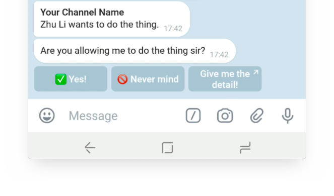

## {mono}push

Get a push notification to your smartphone / computer easily.

### Features

{mono}push allows you to send push notifications with the following message types.

To send push notifications via {mono}push, simply send a http [POST] request to the following url.

`[POST] https://webhook.monopush.io/telegram/[YOUR-TOKEN]`

You can take your `YOUR-TOKEN` by applying following steps.

#### Basic Push Notification (Just text)

Bu push notification tipi basit text mesajlar göndermeniz içindir.

```json
{
  "message" : "I have completed your action."
}
```


#### Advanced Push Notification  - (with action buttons)

This push notification type can also take action via push notification you have sent.

For example, by adding buttons to a push notification that you have sent, you can have another API triggered, or you can add a link to a button and open a web page when it is clicked.

```json
{
    "message": "Zhu Li wants to do the thing.",
    "action": "Are you allowing me to do the thing sir?",
    "buttons": [
        {
            "id": "YES",
            "text": "✅ Yes!",
            "webhook": "https://your-web-hook-url",
            "success_message": "👍 Done. Zhu Li did the thing",
            "error_message": "Zhu Li having trouble to do the thing!"
        },
        {
            "id": "NO",
            "text": "🚫 Never mind",
            "success_message": "🖖 Don't worry, I have canceled it."
        },
        {
            "id" : "info",
            "text" : "Give me the detail!",
            "url": "https://www.google.com/search?q=zhu+li+do+the+thing&oq=zhu+li+do+the"
        }
    ]
}
```

Preview



#### Normal Group and Super Group Support

You can also use {mono}push by inviting your group and super groups like a user. When you do that, you can send messages and actions to the group.

For actions taken within the group, information is also given about who triggered the action.

Note that you need to send the relevant messages in the group to create a channel for a group or super group.

### How to get a token

To set a new channel name and receive a message via that channel, you need to send a message from the {mono}push channel.

You can use [this url](http://t.me/monopush) to do that.

If you don't have Telegram, you can use [this url](https://telegram.org/) to download Telegram for all platforms.

To create a new channel and get a private url for you just type;

```
/new  Your Channel Name
```

After that, you will get a message like this;

```
Your webhook is ready for sending message. Use;
https://webhook.monopush.io/telegram/5bb846648f74a60001284fb5

{
  "message": "Hi there!"
}
```

When you send an http post request with the following information you will receive a message directly with the corresponding channel name via the {mono} push.

| Header | Value |
|-|-|
| Method | POST |
| Content-Type | application/json |

### How it works?

{mono}push allows you to send push notifications via the API. It sends push notifications through [Telegram](https://telegram.org). Telegram is a secure and free messaging service with end-to-end encryption mechanism.

{mono}push conveys these messages via a bot written on Telegram.

In the next versions, we also intend to provide support for Messenger, Skype and similar platforms.

